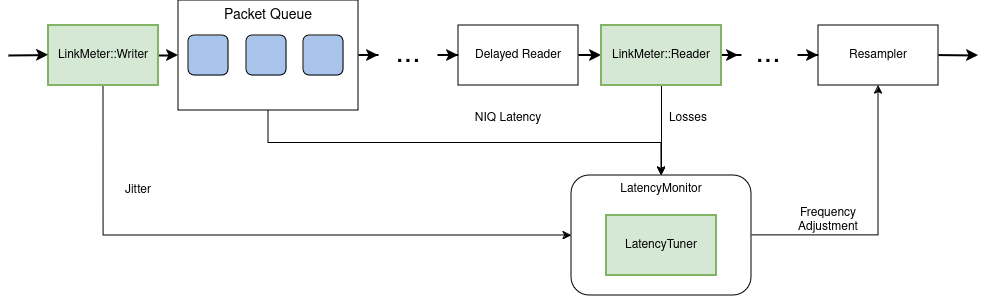
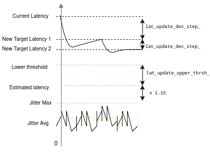

Run-time latency auto-tune
**************************

Overview
========

``LatencyTuner`` estimates required latency by this formula: ``MAX(max_jitter * 1.15, avg_jitter * 3, FEC block len)``.
And then it decrease or increases the **target latency** value in ``LatencyMonitor`` internal regulator to somewhat
closer to the estimated value then it was before, by operating in such manner we split potentially long travel for
regulator into several smaller stages equally distributed in logarithmic scale, which in theory should make the tuning
process easier.

How is this parameterized
=========================

According to overview we have two main actors involved into latency auto-tuning process: ``LinkMeter`` and
``LatencyTuner``. Here we list their internal parameters which characterize latency adjustment process. These values
could be defined directly or indirectly by corresponding configs.

``LinkMeter``
    * ``win_len_``: number of incoming packets for gather sliding window **average**, **min**, and **max**.

``LatencyTunter``:
    * Timeouts:

        * Start timeout -- do not adjust latency right after start
        * Increment and decrement timeouts:
            do not change latency right after the previous change ends.

    * ``LatencyTuner::lat_update_upper_thrsh_`` - defines the lower margin, so that we don't decrease latency for too
        small difference
    * ``LatencyTuner::lat_update_dec_step_``-- ``new target latency = current * lat_update_dec_step_``
    * ``LatencyTuner::lat_update_inc_step_``-- ``new target latency = current * lat_update_inc_step_``
